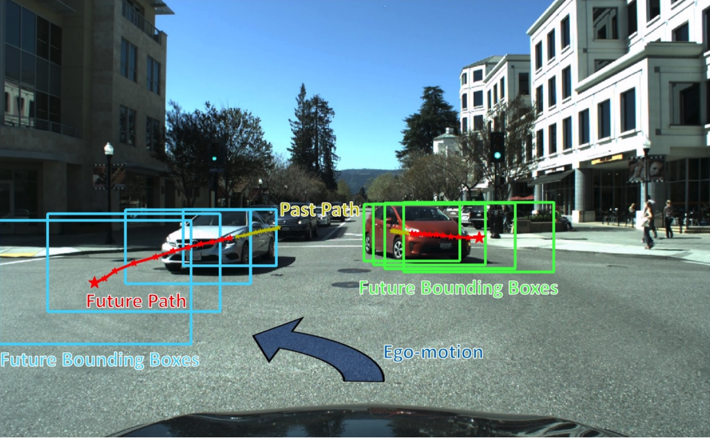

# Exercise: Motion Planning with Uncertainty {#motion-planning-with-uncertainty status=ready}
Martin Weiss, Gunshi Gupta, Vincent Mai

The code and technical documentation for this exercise are [here](https://github.com/mweiss17/pathplanning).

## Pre-Requisites

* An optimistic outlook on life
* ROS Kinetic, Lunar, or Melodic, Python 2.7, catkin, scipy
* A basic understanding of path planning

## Skills learned

* How to use a very simple simulator that we designed with ROS and python
* Advanced Motion-Planning techniques

## Introduction to Motion Planning with Uncertainty

During the lectures, we saw many classic methods of motion planning such as graph-search methods, variational methods, and incremental search methods. The goal of motion/path-planning is generally to get from A to B without crashing, using too many resources (time, gas), or otherwise violating some specified constraints. Most systems that we're interested are non-holonomic, where the velocities (magnitude and or direction) and other derivatives of the position are constrained by some dynamics of the vehicle (e.g. your truck has a minimum turning radius).

We are going to focus on a significantly more difficult problem in this tutorial, planning under uncertain conditions. There are many kinds of uncertainty including uncertainty over your initial state, your action model, and your noisy sensors.

 
*I'm not sure what's happening here*

The world is inherently dynamic, but the algorithms we've looked at don't directly deal with dynamic obstacles. A naive solution is to, at each time-step, update your belief over the world-state (presumably reflecting the new position of dynamic objects in your environment) then regenerate your plan as though all obstacles are static. A bit more advanchttps://github.com/mweiss17/docs-exercisesed solution may estimate the average velocity of dynamic obstacle across recent time-steps, then assume it will continue in the same way. The following work devises a way to remove egocentric movement from the motion prediction for dynamical obstacles.

 
Egocentric Vision-Based  Future Vehicle Localization for Intelligent Driving Assistance Systems 
*Yu Yao∗, Mingze Xu∗ , Chiho Choi, David J. Crandall, Ella M. Atkins, and Behzad Dariush*

 

Creating a good model of dynamic obstacles is much, much harder than it sounds. Humans mess this up all the time. Take, for example, the situation presented in the image above. You're trying to turn left, you have a green light, and no one is currently in your way. We see that the path-planning module, using its estimates of the oncoming vehicles position at previous timesteps, is predicting that the silver oncoming Mercedes is going to get in our way. But what if that driver is some kind of maniac and swerves in front of you? It happens. There's an enormous amount of unavailable information that must be modeled as uncertainty.

 
*We don't always know who's coming down the road, but sometimes it's this maniac in a lambo*
 

 To approach this problem we created an entirely deterministic situation in our simulator, added some stochastic behaviour to an oncoming duckiebot, created a probability distribution over their velocity, and use that distribution to inform our motion plan.

## Experimental Setup

To support this exercise, we designed a very simple 2-D (overhead view) simulator. It models a road with two lanes and two duckiebots. One is "ours" and the other is our adversary (lambo maniac) who we must avoid.

Similar to the setup in Duckietown, we have a small positive reward for staying in our lane, a small negative reward for crossing into the opposite lane, and larger negative rewards for leaving the road entirely or colliding with the other duckiebot.

### Problem we want to solve:

Imagine you are driving on a straight two-lane road, you're in your lane, when you suddenly see in front of you a big truck driving down the middle of the road! It is so big, that you have no choice but to avoid it by partially driving off the road. You know he's coming right at you (constant angle), but you're not sure how fast (his acceleration changes randomly). How do you plan your trajectory to avoid collision and minimize your off-road adventure?
This problem comes in two flavours: the truck is oncoming, or it is going in the same direction as us. A robust solution should perform well in both cases.

### Our solution:

Our solution predicts the probability of the other duckiebot's position w.r.t. time, using a probabilistic velocity model to propagate its possible positions over a one-dimensional discretized map. We are then able to compute the probability of a collision at any position and time. We use a Monte Carlo Tree Search algorithm to compute rewards for states in this map and approximate our optimal trajectory up to a given time horizon.

### The exercise:

Can you do better than us? We instantiate a predictor and a planner in `include/dt_agent/agent.py`. Add your own predictor and planner in the same folder, and don't forget to include them in the `include/dt_agent/__init.py__`. Compare with our version by measuring your score at t = 25 sec.
But first, you'll have to install the thing (which should take ~30 minutes if you've got the pre-requisite ROS installation and a couple hours if you have to install Ubuntu and ROS). [Find our code and learn how to use it here](https://github.com/mweiss17/pathplanning).

## Our results
Our solution works well. Kind of. Here are some results and analysis we would like to share.

### Gifs
These gifs show the output of the visualizer with different MCTS parameters. We took the case of the truck coming towards us, with a random acceleration picked from a continuous uniform distribution from -2 m/s to + 2 m/s at each time step. The trajectory was recomputed every 3 time steps.

#### With default parameters

MCTS parameters:
  * scalar: 1.414
  * budget: 5300
  * time_steps: 50
  
#### With 20 time steps

 MCTS parameters:
  * scalar: 1.414
  * budget: 5300
  * time_steps: 20

#### With a budget of 2000 iterations

MCTS parameters:
  * scalar: 1.414
  * budget: 2000
  * time_steps: 50

#### Increasing the explore parameter to 2

MCTS parameters:
  * scalar: 2
  * budget: 5300
  * time_steps: 50

### Analysis
#### Fluidity of the gifs
the gifs are not very fluid. Why? In order to accelerate the gifs, we removed the waiting time at each time step. Therefore, the Simulator goes very quickly through 3 time steps, and then waits for the Agent to compute the next trajectory.

#### Variable trajectory length
The trajectory length is not constant. Sometimes, it is very short, sometimes, very long. This is because the depth of the tree changes depending on the region it is being optimised in. In some regions, the tree can have a lot of children with competitive reward possibilities, so the tree becomes wider, but less deep. Therefore, the optimal path might have a different length.

#### Avoiding the Duckiebot
The agent always avoids the other Duckiebot! That's great - it shows that our algorithm is working!

#### Avoiding to get out of the road
However, our agent somehow decides to get completely out of the road. This is bad, because we set the negative reward of being completely out of the road as bad as having a collision! Additionnally, it is not necessary to avoid the other Duckiebot. What is happening here?

Our analysis of the problem is that our MCTS does not explore enough at the very beginning. When the agent plans to go out of the road on a long term trajectory, it correctly does not get completely out of the road. However, when the agent follows this trajectory, it has at some point to be partially out of the road and looking to the right. Its trajectory plans that the next step will be turning on the left, and all will be fine.But, just when it gets there, the trajectory is completely recomputed! Unluckily, the agent chooses to simply go forward as a first step instead of exploring the other directions. This leads to the agent getting lost in the wild... for a small amount of time, until it gets back on the road. 

This problem could be reduced by reducing the time step duration, increasing the exploration or increasing the amount of time steps for which the trajectory is followed. However, the two first options induce a higher computation time for the agent, whereas the last option means driving with more uncertainty, which adds to the probability of a collision.

#### Influence of the parameters
Frankly, we find that the 4 experiments look pretty similar. The parameters change a bit the behavior: a lower number of time steps lowers the length of the trajectory, a higher scalar or a higher number of iterations makes the trajectory move a bit more but give a smaller tree depth. But overall, they do not affect the performance so much. We would love to have a more complete analysis to show you, but we hope you will agree with us!

## Drive Safe

